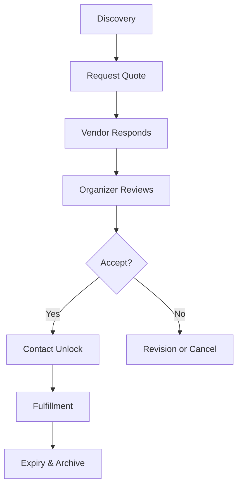
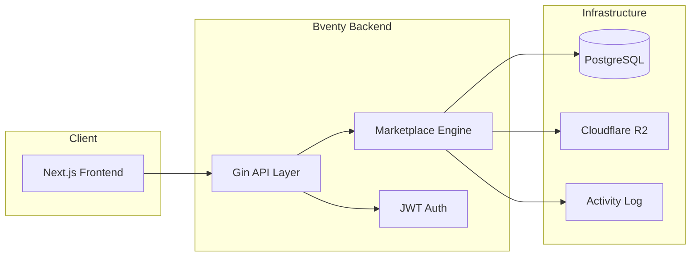

# Bventy

Official Site: [bventy.com](https://bventy.com)
License: [AGPL-3.0](LICENSE)
Trademark Policy: [TRADEMARK.md](TRADEMARK.md)

## What This Is

Bventy is a structured marketplace platform designed to improve how event organizers and service vendors connect. 

In many existing platforms, communication is often chaotic and transactional. Bventy provides a framework where requirements are clarified before personal contact occurs. This ensures that both parties have the information they need to decide if they are a mutual fit. This repository contains the backend service, which acts as the core engine for the Bventy ecosystem.

### Why Bventy Exists

The event industry often suffers from inefficient communication. Organizers spend hours explaining the same requirements to multiple vendors, while vendors receive incomplete requests that make accurate pricing difficult. Bventy solves this by introducing a deliberate, staged workflow that protects time and privacy for everyone involved.

---

## Design Principles

Our architecture is guided by six core principles that define the Bventy experience.

1.  **Gated communication**: Contact details are protected until a quote is explicitly accepted.
2.  **Structured quote workflow**: A predictable sequence of steps from request to fulfillment.
3.  **Vendor dignity**: Providing vendors with the context they need to price their services fairly.
4.  **Contact expiry by design**: Communication channels automatically close when their purpose is fulfilled.
5.  **Privacy-first architecture**: Data collection is limited to what is necessary for platform operations.
6.  **Transparent analytics**: Insights are focused on system health, not individual user behavior.

---

## Marketplace Lifecycle

The system is built around a deliberate lifecycle to maintain clarity and focus for both organizers and vendors.

### Lifecycle Stages

*   **Discovery**: Organizers find vendors whose work aligns with their event needs.
*   **Request Quote**: Organizers provide specific event parameters to initiate a request.
*   **Vendor Responds**: Vendors evaluate the request and provide a priced proposal.
*   **Organizer Accepts**: If the terms are suitable, the organizer approves the quote.
*   **Contact Unlock**: Secure contact information is revealed to both parties.
*   **Expiry & Archive**: Completed or inactive requests are archived to keep the workspace clean.

---

## Architecture Overview

Bventy is composed of several focused layers that work together to provide a reliable marketplace experience.

### Components

*   **Backend Service**: A Go service providing the marketplace logic and REST API.
*   **Database**: PostgreSQL for relational data and state permanence.
*   **R2 Storage**: Secure object storage for attachments and media.
*   **Activity Log**: A unified layer for audit trails and platform health metrics.

---

## Documentation Index

We maintain detailed documentation for every aspect of the platform.

### Architecture
- [System Overview](docs/architecture/overview.md)
- [Backend Deep Dive](docs/architecture/backend.md)
- [Frontend Integration](docs/architecture/frontend.md)
- [Data Model & Schema](docs/architecture/data-model.md)
- [Analytics & Tracking](docs/architecture/analytics.md)

### Marketplace Lifecycle
- [The Quote Flow](docs/lifecycle/quote-flow.md)
- [Contact Expiry Logic](docs/lifecycle/contact-expiry.md)
- [Lifecycle State Diagram](docs/lifecycle/state-diagram.md)

### Privacy & Security
- [Privacy Principles](docs/privacy/principles.md)
- [Data Handling Policy](docs/privacy/data-handling.md)
- [Security Architecture](docs/privacy/security.md)

### Developer Guides
- [Setup Instructions](docs/developers/setup.md)
- [Environment Configuration](docs/developers/environment.md)
- [Contribution Guidelines](docs/developers/contribution-guide.md)

### User Guides
- [For Organizers](docs/organizers/how-it-works.md)
- [For Vendors](docs/vendors/how-it-works.md)

---

## Privacy Approach

We take a deliberate approach to user data.

- **No session replay**: We do not record user screens or mouse movements.
- **No invasive tracking**: We avoid third-party scripts that profile users across the web.
- **Operational analytics only**: We gather data primarily to monitor system stability and platform metrics.
- **Vendor contact never public**: Personal emails and phone numbers are never exposed in profile views.
- **Contact automatically expires**: The system manages the availability of contact data based on lifecycle.

---

## License

This project is licensed under the **GNU Affero General Public License v3 ([AGPL-3.0](LICENSE))**. 

In plain language: the software is free to use, modify, and distribute. However, if you modify Bventy and deploy it as a network service, you are required to make your modified source code available to your users under the same license. This ensures that improvements to the community version of the platform remain available to everyone.

---

## Roadmap

Our current focus includes:

- **Reviews**: A structured feedback system for vendors and organizers.
- **Vendor performance scoring**: Helping organizers make informed decisions.
- **Escrow system**: Investigating secure payment handling to protect both parties.
- **Commission layer**: Logic for platform sustainability.
- **Mobile clients**: Native experiences for better on-the-go management.

This roadmap is subject to change based on community needs. No specific timelines are promised.

---
© 2026 Bventy.