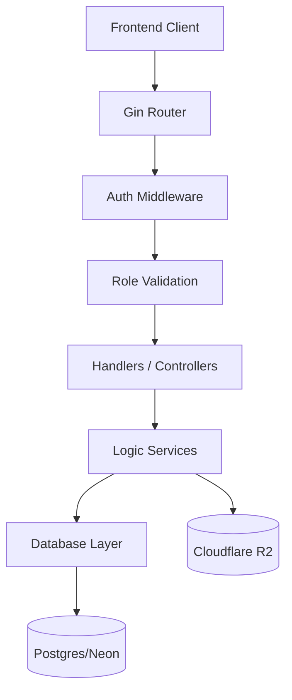

# System Architecture

Bventy API follows a modern, layered approach in Go, emphasizing separation of concerns and maintainability.

## 🏗 Architectural Layers

### 1. **Entry Point (`cmd/api`)**
The entry point initializes the configuration, database connection pool, and the Gin engine. It also defines the CORS policy and triggers route registration.

### 2. **Routing (`internal/routes`)**
The routing layer maps HTTP endpoints to their respective handler functions. It groups routes by domain (e.g., `/quotes`, `/vendors`, `/admin`) and applies the necessary middleware chains.

### 3. **Middleware (`internal/middleware`)**
- **AuthMiddleware**: Extracts and validates JWT from the `Authorization` header.
- **RoleCheck**: Ensures the authenticated user has the required privileges (`admin`, `vendor`, or `organizer`) for specific endpoints.

### 4. **Handlers (`internal/handlers`)**
Handlers parse incoming requests, validate input data (binding), call the relevant services or database queries, and return standardized JSON responses.

### 5. **Services (`internal/services`)**
Encapsulates complex business logic that spans multiple models or involves external integrations (e.g., File Uploads to R2, tracking to PostHog).

### 6. **Data Storage (`internal/db`)**
Uses `pgx` for performance-oriented PostgreSQL interaction. The architecture favors clean SQL queries for transparency and performance.

## 📊 Core Data Flow: Quote Request

1. **Request**: Organizer sends a quote request via `POST /quotes`.
2. **Validation**: `QuotesHandler` validates the payload (Budget, Event ID, Message).
3. **Transaction**: The system creates a entry in `quote_requests` table.
4. **Trigger**: The application logic triggers notifications or status updates.
5. **Vendor Perspective**: `GetVendorQuotes` handler retrieves active requests for the specific vendor.

## 🛡 Security Patterns
- **JWT Stateless Auth**: No session state in the backend; all identity is derived from signed tokens.
- **SQL Injection Prevention**: Exclusive use of parameterized queries.
- **CORS Restricted**: Allowed origins are strictly limited to production domains and `localhost:3000`.

## 📦 Infrastructure
- **Neon (DB)**: Serverless Postgres providing auto-scaling and branching.
- **Cloudflare R2 (Media)**: S3-compatible storage with zero egress fees, used for vendor galleries and portfolios.
- **Render/Railway (Compute)**: Horizontal scaling of the Go binary.
