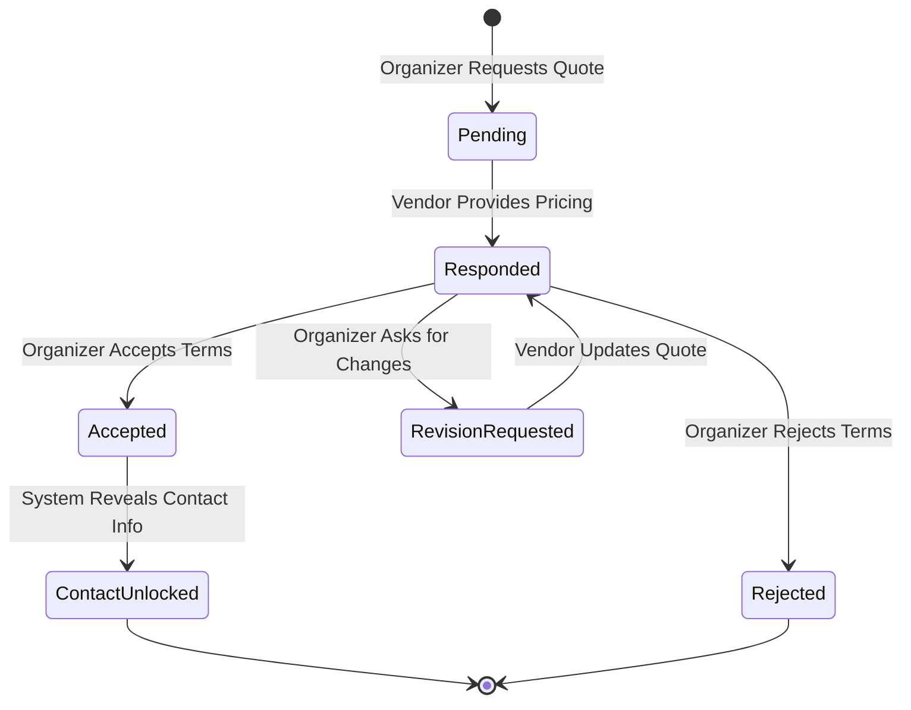

# Marketplace Lifecycle

Bventy manages the interaction between event organizers and vendors through a structured quote system. This ensures that expectations are aligned before any personal contact information is exchanged.

## Quote State Diagram

## Lifecycle Stages

### 1. Request
Organizers provide:
- Event details (ID, Guest count).
- Budget preference.
- A descriptive message explaining their needs.

### 2. Response
Vendors provide:
- Quoted price.
- Detailed response message.
- Optional attachments (Rate cards, portfolios).

### 3. Deliberation
The organizer can choose to:
- Accept: Agreement reached.
- Reject: Communication ends.
- Revise: Ask for specific changes in the quote or pricing.

### 4. Unlock
Upon acceptance, the system provides both parties with their respective contact emails and phone numbers to finalize off-platform.

### 5. Archiving
Quotes automatically move to an archive state after completion or rejection to maintain focus on active requests.
