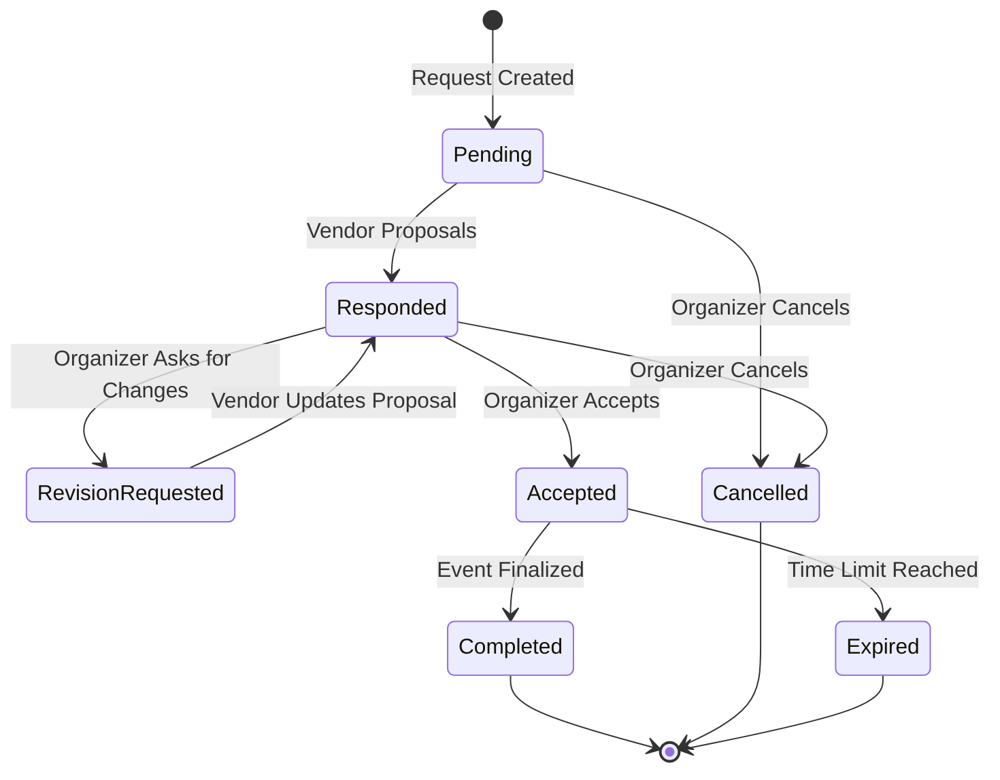

# Quote State Diagram

The lifecycle of a quote is managed by a finite state machine. This ensures that every interaction is valid based on the current context.

## State Definitions

- **Pending**: The initial request is awaiting a vendor response.
- **Responded**: A proposal has been submitted and is under review.
- **RevisionRequested**: Feedback has been provided; a modified response is expected.
- **Accepted**: Terms are agreed upon; contact details are unlocked.
- **Completed**: The engagement has reached its natural conclusion.
- **Cancelled**: The request has been terminated by the organizer.
- **Expired**: Access has been revoked due to inactivity or time limits.
